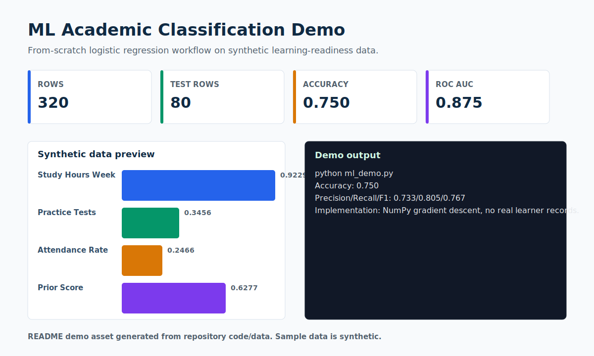

# ML Academic Classification Demo

> A complete classification workflow on synthetic learning-readiness data.



## Recruiter Snapshot

| 30-second question | Answer |
| --- | --- |
| Problem | A junior ML portfolio project should show the full modeling path without using real student or learner records. |
| My role | I generated a seeded synthetic dataset, implemented logistic regression with NumPy gradient descent, evaluated multiple metrics, and wrote the interpretation limits. |
| Result | The run reports 320 rows, 80 test rows, 0.750 accuracy, and 0.875 ROC AUC on synthetic data. |
| Portfolio signal | Shows ML fundamentals, not just library calls: split strategy, scaling, training loop, metrics, and caution around interpretation. |
| Data policy | All records are synthetic and safe for a public portfolio. |

## What I Built

- Stratified train/test split with standardized numeric features.
- Logistic regression trained from scratch with NumPy.
- Metrics saved to `metrics.json` when the script runs.

## Evidence In This Repo

- `ml_demo.py` contains the complete workflow.
- `synthetic_ml_data.csv` contains the synthetic feature table.
- `assets/demo.svg` summarizes the latest local run for GitHub.

## Tools And Concepts

`Python`, `NumPy`, `pandas`, `classification`, `ROC AUC`, `model evaluation`

## Run Locally

```bash
python -m pip install -r requirements.txt
python ml_demo.py
```

## Limitations

Synthetic relationships are deliberately learnable. This model must not be used to make decisions about actual learners or people.

## Next Iteration

- Add cross-validation and calibration checks.
- Add threshold analysis and feature-effect plots.
- Add a short model card.

## Data Privacy

Every record, identifier, organization, person, scenario, and result in this project is synthetic unless explicitly marked otherwise. No employer, client, university, colleague, customer, credential, private path, or sensitive personal record is used.
